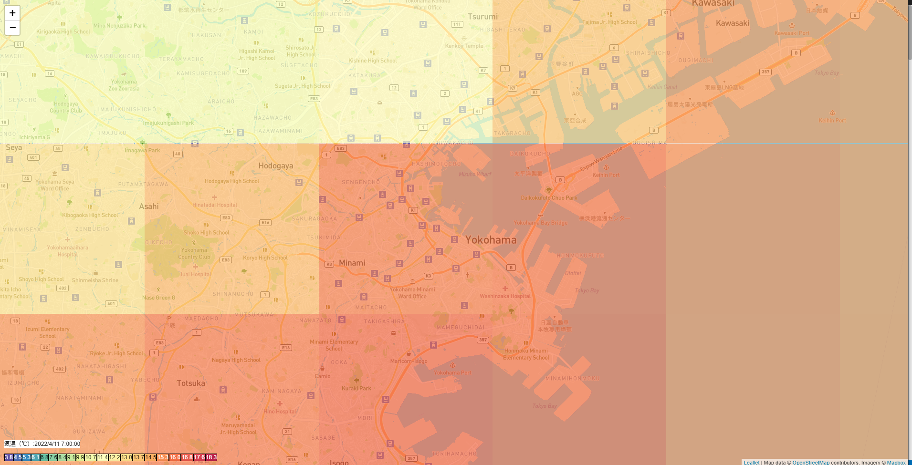
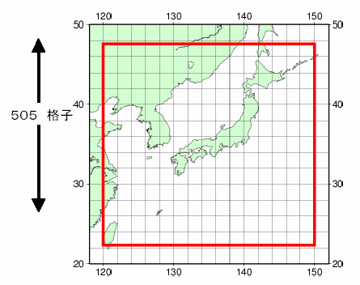
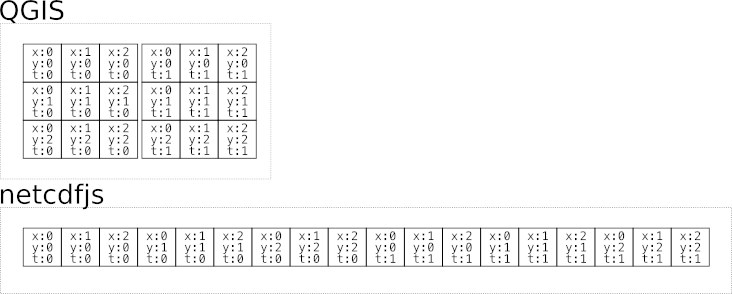
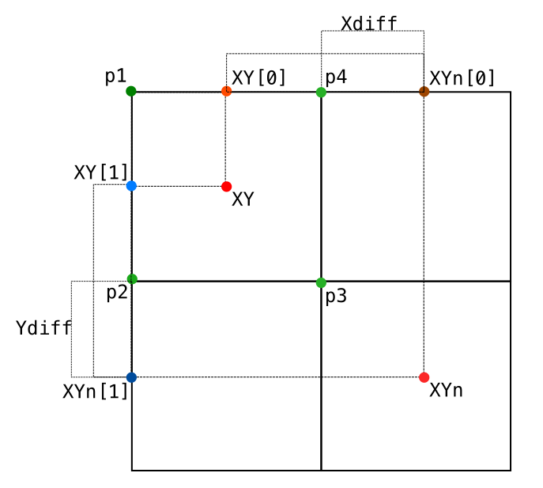
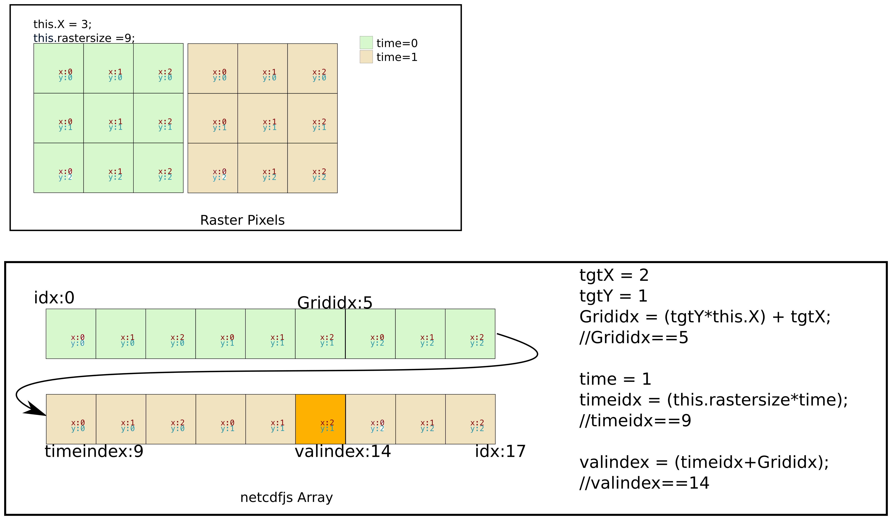
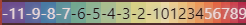

# leafletGPV
## 概要
NetCDF形式のメソ数値予報モデルGPV（MSM-S）を**Electron**上のleafletで表示できます。

## 使い方
### 必要環境
* Electron
* npm
* Turf.js
* Leaflet
### サンプルの実行
* sampleフォルダのCDFに[最新のGPV(MSM-S)](http://database.rish.kyoto-u.ac.jp/arch/jmadata/data/gpv/latest/MSM-S.nc)をダウンロードします。
* sampleフォルダで下記のコマンドを実行します。

```
npm start
```
### 実装
```js
new BrowserWindow({
    webPreferences: {
      preload: path.join(__dirname, 'js/loadcdf.js'),
      contextIsolation: true,
    }
});
```
main.jsのBrowserWindow->webPreferences->preloadfsモジュールで読み込んだバイナリを
ブラウザサイドに読み込むスクリプトを指定します。
```js
const { contextBridge } = require("electron");
const fs = require('fs');
const gpvpath = "CDF/MSM-S.nc";

contextBridge.exposeInMainWorld(
  "requires", {
  LoadCDF: () => {
    
    var GPV = fs.readFileSync(gpvpath);
    return GPV;
  }
});
```
スクリプトタグで下記のモジュールを読み込みます
```html
<script src="https://unpkg.com/leaflet@1.7.1/dist/leaflet.js" integrity="sha512-XQoYMqMTK8LvdxXYG3nZ448hOEQiglfqkJs1NOQV44cWnUrBc8PkAOcXy20w0vlaXaVUearIOBhiXZ5V3ynxwA==" crossorigin=""></script>
<script src='https://npmcdn.com/@turf/turf/turf.min.js'></script>
<script src="{leafletGPV.jsのパス}"></script>
<script src="{netcdfjs.jsのパス}"></script>
<script src="https://cdnjs.cloudflare.com/ajax/libs/chroma-js/2.4.2/chroma.min.js"></script>

```
loadcdf.jsのgpvpathで指定したパスのGPVを読み込み
creatGPV関数でweatherGPVが生成されます。
```js
var buffer = window.requires.LoadCDF();
creatGPV(buffer);
```
### 気温レイヤーの作成
この例では予報開始時刻の1時間あとのレイヤーを作成します。
```js
weatherGPV.makeWeatherLayer();
```
予報値のレイヤーを作成

```js
weatherGPV.time = 1;
```
予報開始時刻の1時間後を指定
```js
weatherGPV.makeTempLayer();
```
気温の単バンド疑似カラーのレイヤーを作成します。
```js
setScaleLegendByID(weatherGPV.tempcolor,"<任意のID>");
```
任意のIDのDOMの子要素に凡例を表示します。


#### netcdfjsとGPVの格納方式

**引用:一般財団法人　気象業務支援センター,[メソ数値予報モデルGPV（MSM）](http://www.jmbsc.or.jp/jp/online/file/f-online10200.html),（2022/04/11）**
MSM-SはX:481、Y:505の格子点で予報値を34時刻=バンドに格納しています。
緯度経度もこの格子点形式で格納されています。
それを基にラスターデータを作る事が可能です。

**t=経過時刻**
この図のようにQGISでは事前に変換処理が行われるため
各予報値が時間毎の2次配列の画像として取得できる事に対し
netcdfjsは1次配列であり、適切に時間ごとの2次配列に処理する必要があります。

かつ1つのピクセルも**0.05度×0.0625度**で正方形ではないため
turfでピクセルのポリゴンの一括作成は利用できないため緯度経度の格子点を基に実装します。
#### GPVラスターデータの構築
コンストラクタでラスター生成に必要な変数を定義します。
```js
class GPVdata {
    constructor(filepath,rasterMincoord,rasterMaxcoord) {
```
コンストラクタは
GPVのファイルパス、
描画するラスター領域の最小の座標、
描画するラスター領域の最大の座標を引数に取ります。
描画する範囲を指定する理由は全領域を描画する場合GISの反応が遅延するためです。
```js
        //netcdfを読み込み
        this.GPV = fs.readFileSync(filepath);
        this.reader = new netcdfjs(this.GPV);
```
**this.reader**でnetcdfを読み込みます。
```js
        //緯度経度の配列を取得
        this.lon_array = this.reader.getDataVariable("lon");
        this.lat_array = this.reader.getDataVariable("lat");
```
**this.lon_array**:経度(X)の長さ481の1次配列、**経度配列**
**this.lat_array**:緯度(Y)の長さ505の1次配列、**緯度配列**
```js
        this.rasterMincoord = rasterMincoord;
        this.rasterMaxcoord = rasterMaxcoord;
```
```js
        //XYと時間
        this.X = 0;
        this.Y = 0;

        for (let index = 0; index < this.reader.dimensions.length; index++) {
            var element = this.reader.dimensions[index];
            if (element.name == "lon") {
                this.X = element.size;
            }
            if (element.name == "lat") {
                this.Y = element.size;
            }
        }
        //1次配列のラスターサイズ
        this.rastersize = this.X * this.Y;
```
**this.rasterMincoord**:描画するラスター領域の最小の座標
**this.rasterMaxcoord**:描画するラスター領域の最大の座標
**this.X**:X軸のピクセル数この場合481
**this.Y**:Y軸のピクセル数この場合505
**this.rastersize**:ラスターデータ1バンド分の1次配列のラスターサイズ

コンストラクターで定義した変数の図示
```js
var emptyGrid = [];
for (let index = 0; index < this.lat_array.length - 1 ; index++) {
    var lat = this.lat_array[index];
    if ( lat < this.rasterMincoord[1] || this.rasterMaxcoord[1] < lat) {
        continue;
    }
    var latn = this.lat_array[index + 1];
    for (let lonindex = 0; lonindex < this.lon_array.length - 1 ; lonindex++) {
        var lon = this.lon_array[lonindex];
        if ( lon < this.rasterMincoord[0] || this.rasterMaxcoord[0] < lon ) {
            continue;
        }
        var lonn = this.lon_array[lonindex + 1];
```

経度配列、緯度配列の順に添え字をインクリメントしループします。
描画領域外の場合は**continue**で続く処理をスキップします。
網掛けが描画領域内で続く処理を続行します。
**lat**は緯度
**lon**は経度
**latn**は一つあとの添え字の緯度
**lonn**は一つあとの添え字の経度
```js   
        var XY = latlontoXY([lon,lat]);
        var XYn = latlontoXY([lonn,latn]);
```
緯度経度は球面上の位置を示すため角度を座標として扱う極座標です。
したがって処理しやすい直行座標系(メートル)に変換します。
**XY**は緯度経度から求めたXY座標
**XYn**は一つあとの添え字の経度経度から求めたXY座標
```js
        var Xdiff  = (Math.abs(XY[0]-XYn[0]))/2;
        var Ydiff  = (Math.abs(XY[1]-XYn[1]))/2;

        var p1 = [XY[0]-Xdiff,
                    XY[1]-Ydiff];

        var p2 = [p1[0],
                    p1[1]+(Ydiff*2)];

        var p3 = [p2[0]+(Xdiff*2),
                    p2[1]];

        var p4 = [p3[0],
                    p3[1]-(Ydiff*2)];

```

変換したXY座標は目的のピクセルの中心点であるため、
図のように１つあとの座標を利用して、**p1~p4**までの座標を求めます。
```js
        var cellcoord = [[p1,p2,p3,p4,p1].map(function (coord) {
            return XYtoLatlon(coord)
        })];
```
求めた座標を緯度系に戻します。
mapは配列の要素に対してコールバックの
関数を実行した結果の配列を生成します。
```js
        //属性値の取得
        var Grididx = (index*this.X) + lonindex;
        //予報から12時間後の場合
        var time = 12;
        var timeidx = (this.rastersize*time);
        // timeidx = 0;
        var valindex = (timeidx+Grididx);
        var rasterVal = this.reader.getDataVariable("temp")[valindex];

        var fixval = this.getDegree(rasterVal);
        var polygon = turf.polygon(cellcoord,
                                    {"val":fixval,
                                    "X":XY[0],
                                    "Y":XY[1],
                                    "lon":lon,
                                    "lat":lat});
        emptyGrid.push(polygon);
        
    
    }
}
templayer = turf.featureCollection(emptyGrid);
```
**上記から下記のコードは例であるため実装とは異なります**
予報開始12時間後の気温を取得するコードです。
**Grididx**はピクセルのXYの添え字を1次配列に変換しています。
**timeidx**さらに時間毎のデータも1次配列に格納されているため、
時間分の添え字を算出しています。
**turf.polygon**で座標値と属性値を基に4角形のピクセルのポリゴンを生成します。
ポリゴンを1次配列**emptyGrid**に追加します。
**turf.featureCollection**でピクセルのポリゴンを追加した1次配列から
ラスターデータを生成します。


ラスターデータと時間、netcdfjsの予報値の関係性
および取得方法を簡略的に説明した図です。
時刻1のX:2,Y:1の予報値の取得をしています。
1次配列の画像のためＹに画像幅を乗算したものにＸを加算します。
その添え字にラスターデータ1バンド分のピクセル数と時間を乗算したものを加算します。
#### GPVラスターデータのスタイル設定
```js
        var temps = [];
        for (let index = 0; index < templayer.features.length; index++) {
          var degree = templayer.features[index].properties["val"];
          templayer.features[index].properties["val"] = degree;
          temps.push(degree);
        }
        
        var color_scale = chroma.scale('Spectral').domain([Math.max.apply(null,temps),
                                                           Math.min.apply(null,temps)]);
```
ラスターデータを作成したためスタイルを生成します。
設定するスタイルはQGISにおける単バンド疑似カラーです。
**templayer.features**はピクセルです。
空の1次配列**temps**を生成し、ピクセルの気温の予報値を追加します。

**chroma**はカラーランプを生成するライブラリです。
**chroma.scale('Spectral').domain**の引数にtmepsの最小値、最大値を配列として
与えることでカラーランプのオブジェクトを生成します。
```js
        function style(feature) {
            return {
                fillColor:color_scale(feature.properties["val"]).hex(),
                weight: 2,
                opacity: 0,
                fillOpacity: 0.7
            };
        }
```
この関数はラスターレイヤー生成時にコールバックとして渡す関数です。
引数featureはピクセルです**fillColor**要素で、**color_scale**で予報値を整数値のカラーコードに変換します。
.hex()で16進数に変換します。
```js
        var gridLayer = L.geoJson(templayer,{style: style});
        gridLayer.addTo(map);
```
 **L.geoJson**で
**turf.featureCollection**で生成したラスターデータと
予報値のカラーランプをスタイルのオプションとしてラスターレイヤーを生成します。


